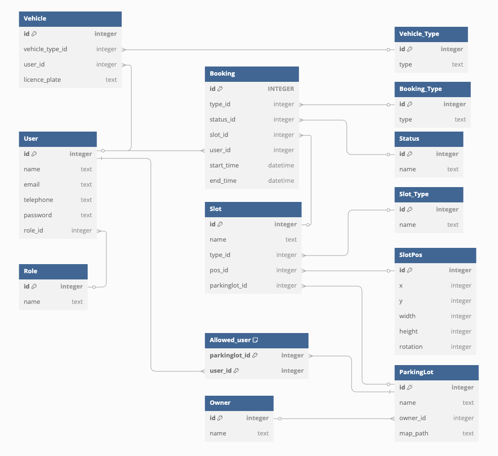

# Documentation for Database

## Structure:

 

## Todo: 
- Image of the parkinglot

## Consider:
- Waitlist

## Create a Diagramm

2. copy the code from ´db_diagram.txt´
3. paste it here: [db](https://dbdiagram.io/d)
4. edit and reorder things
5. take picture (Cmd + Shift + 4)
6. replace ´db_structure.png´ with the new image and replace the code with new the new code